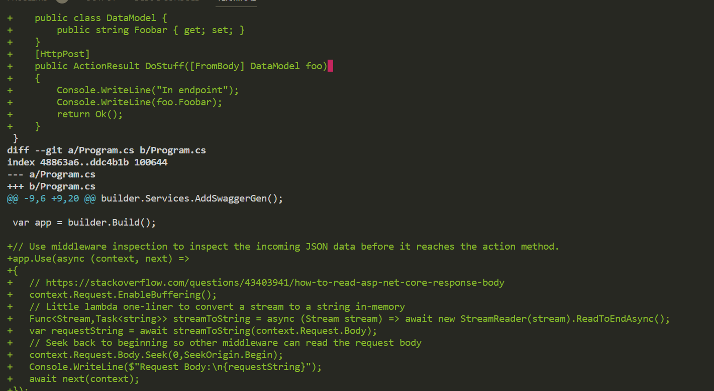
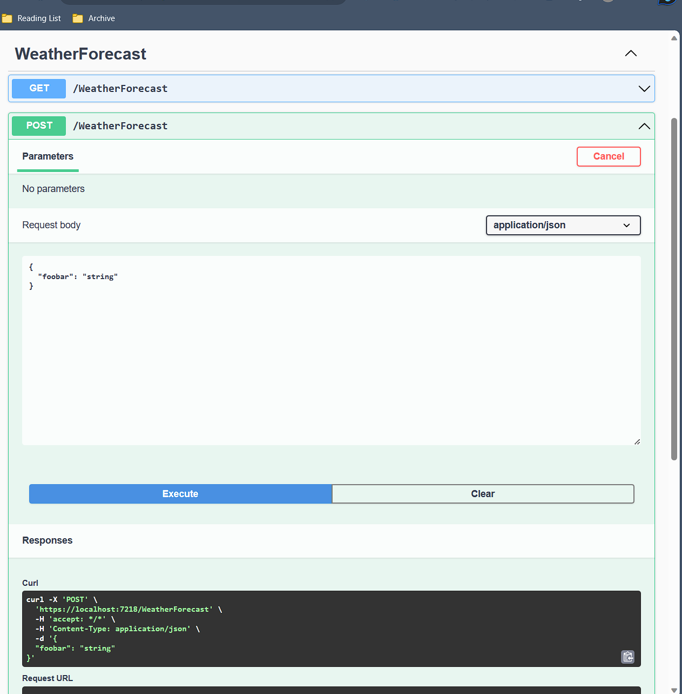
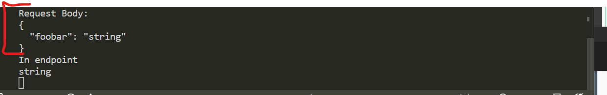

# ASP.NET Core middleware inspection
The project was generated using `dotnet new webapi`.

The commit `84f81d4e57a9a82aca37d0007e6125462b386e7b` on master demonstrates a simple middleware inspection approach. Note that this uses .NET top level Program.cs. Your project  might be using an older version of `Program.cs` without the top-level statements. There are other approaches to configure middleware such as writing a custom class and the `UseMiddleware()` method.

`git show HEAD`.


## Maybe Useful Resources
- [ASP.NET core middleware](https://learn.microsoft.com/en-us/aspnet/core/fundamentals/middleware/?view=aspnetcore-6.0)
- [ASP.NET Core middleware Shawn Widermuth](https://www.youtube.com/watch?v=TqCshF0o0nE&t=42s)
- [JSON serializer options](https://learn.microsoft.com/en-us/dotnet/standard/serialization/system-text-json/configure-options?pivots=dotnet-7-0#web-defaults-for-jsonserializeroptions)
- [A ChatGPT convo for funzies](https://chat.openai.com/share/5cfcf298-0302-44e2-8f06-cb9016bc3b92)


## Running the project
1. Run using command line (doesn't have a .sln file configured)
```bash
# run in working directory of root of project
dotnet run
```
2. From swagger hosted at https://localhost:7218/swagger/index.html, test POST endpoint /WeatherForecast. app.Use() in `Program.cs` logs output to terminal a string of the http request body.


## Environment and Dependencies
- Built using .NET SDK 6.0.408